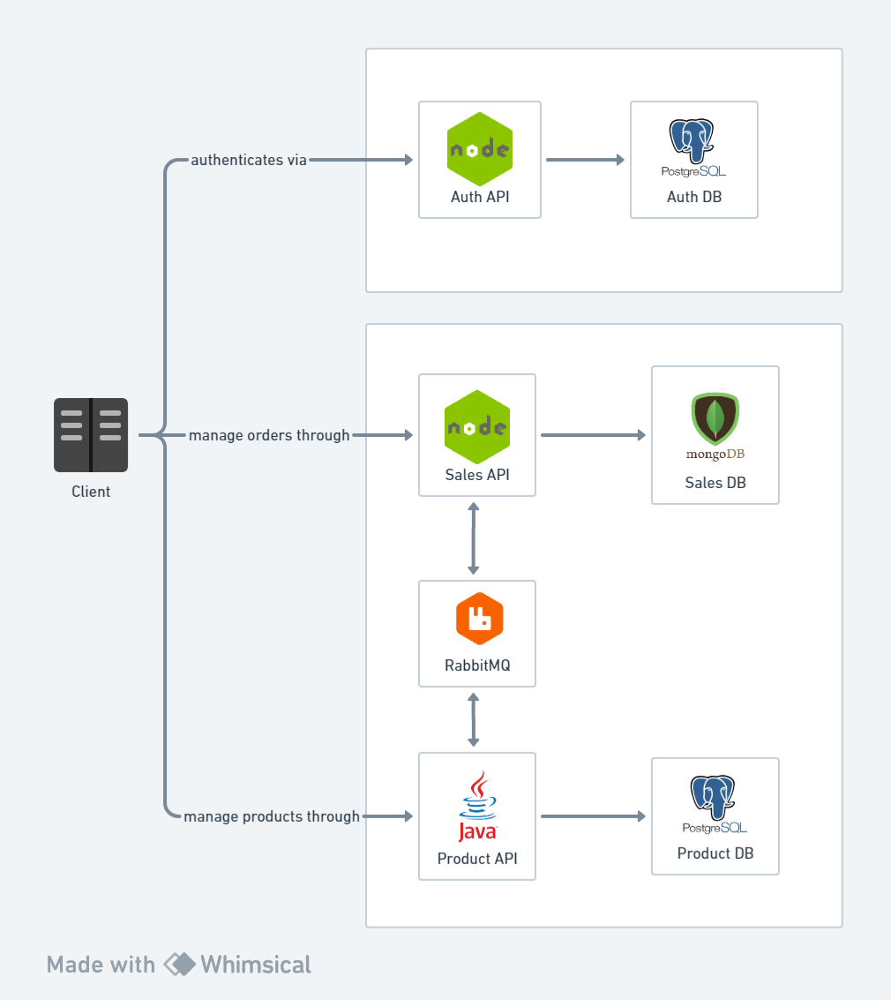
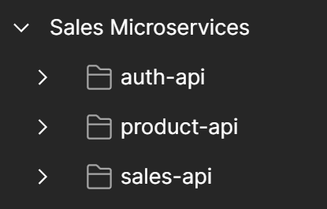

# Sales Microservices

## Introduction

This project has three components, the auth API, the product API, and the sales API. Each of them has its responsibility and purpose. I'll explain the responsibility of each one.

### Auth API

The auth API is responsible for creating the user data and putting this information on a signed JWT token. This API is just consumed and doesn't consume any of the others.

### Product API

The product API is responsible for managing the products, categories, and suppliers. It sends and receives requests and messages from the sales API. It sends requests for getting order info and sends async messages about the received orders, informing if the stock was updated successfully or if something went wrong (e.g. when the product is out of stock).

### Sales API

The sales API is responsible for managing the orders. It sends and receives requests and messages from the product API. It sends requests to get info about the product stock before sending the actual order message and sends the order message when the first check of the stock is okay.

## Macro Architecture

## The workflow

1. The token is generated in the auth API.
2. A request is made for the create order endpoint.
3. The sales API makes a request to check the product's stock in the product API.
4. If the product is out of stock the order is cancelled.
5. If the product stock is ok, the order is saved with the pending status and the order message is sent to the product API.
6. The product API receives the message from the sales API and rechecks the stock.
7. If the product is out of stock, the product API sends the message with the rejected status.
8. If the product stock is okay, the product API sends the message with the approved status.

## Testing the services

The services can be tested through a collection that I put in the content folder. The collection has folders for each one of the services:

The first service that needs to be called is the auth service. I put a script in the get token request so you don't need to pass the access token in the subsequent requests. The script will save the token in a collection variable and the other requests will call this variable and use it.

## Tracing and Transaction IDs

At every request, you must pass a transaction id in the header, so if there is some problem during the request, the application will log this transaction id and this can be used as a tracing method to see exactly which request got errors and what happened in what service, since the same transaction id will be passed from one service to another in a real-world request.

## Technologies

### Shared

- RabbitMQ 3
- Docker
- Docker Compose

### Product API

- Java 21
- PostgreSQL 11
- Spring Boot 3.1
- Spring Data JPA
- Spring Cloud Feign
- Lombok
- JWT

### Sales API

- Node.js 20
- Typescript 5
- MongoDB
- Express
- AMQP lib
- Mongoose
- Axios
- JWT
- Jest
- Tsynringe + reflect-metadata (DI container)

### Auth API

- Node.js 20
- Typescript 5
- PostgreSQL 11
- Express
- Sequelize
- Bcrypt
- JWT
- Jest
- Tsynringe + reflect-metadata (DI container)

## Running the project

You can run this project by running `docker compose up --build` to build all the images and start all the applications.

## Running tests

### Auth and Sales APIs

You can run the tests for the Auth and Sales API by running `npm run test` or `npm run test:coverage` on each project's folder, after installing the dependencies with the `npm install` command.
